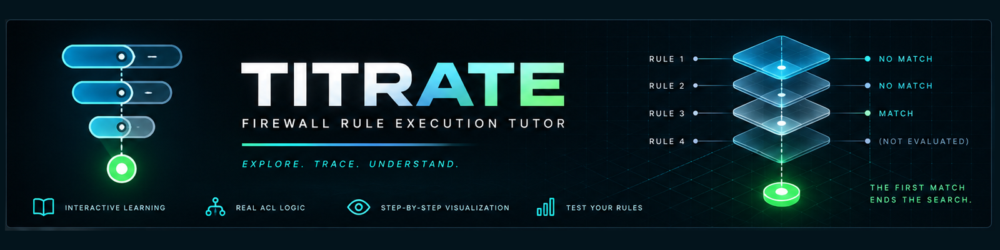
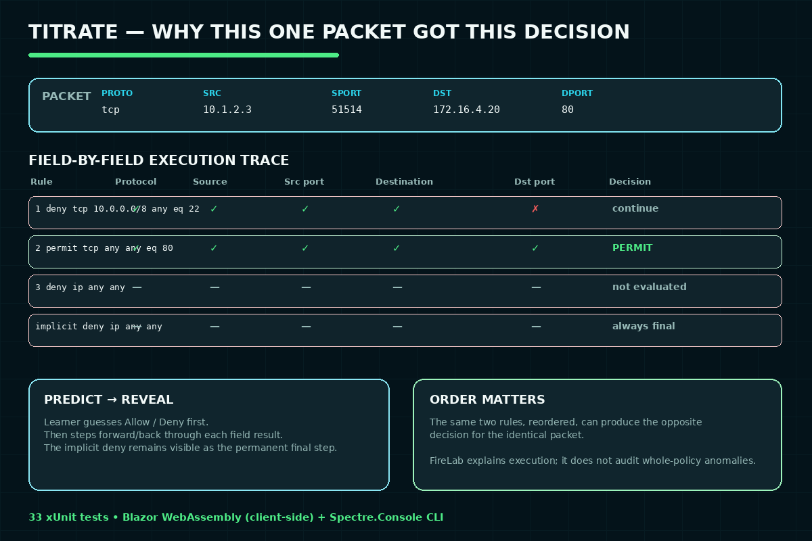

# Titrate — Interactive ACL Execution Visualizer



**Live demo:** https://hnai-787.github.io/titrate/

This started as a WinForms app (tabs for Rules/Packets/Firewall/
Logs) and has been rebuilt into **Titrate**: a browser-based,
step-by-step ACL execution visualizer for learners. The original WinForms
program, its data, and its `.docx` report have been moved out of this
repository into a personal academic-archive repo.
`TODO`: link to that repo once it's published.

## Overview

Firewall Tutor answers a different question than its sibling project,
[Penumbra](../penumbra/): fwlint audits a *whole ruleset*
for structural problems; Firewall Tutor explains *why one specific packet*
got the decision it got, one rule and one field at a time. Paste a Cisco
extended ACL (or use a preset), build a packet, predict what the firewall
will do, then step forward and backward through the exact evaluation —
seeing which field of which rule matched or failed, watching evaluation
stop the instant a rule matches, and seeing the always-present implicit
`deny ip any any` at the end.

```text
fwlint            "Is this ruleset safe/correct?"   static analysis   C++
Firewall Tutor    "Why did THIS packet get THIS decision?"   interactive execution   C#
```

## Problem Statement

Cisco ACL behavior is built from individually simple rules (top-down
processing, first-match-wins, implicit deny) that are still routinely
misunderstood in combination — the classic beginner mistake is putting a
broad `permit` before a narrower `deny`, silently making the `deny`
unreachable. The learning gap isn't "students need another firewall
simulator" (Packet Tracer already does that, and does far more); it's that
students need to see the *execution*, not just the final answer, to build
a correct mental model of first-match evaluation.

## Objectives

- Evaluate one concrete packet against an ordered ACL and produce a full
  execution trace — every rule considered, every field checked, and why —
  not just a final decision.
- Make the "first match wins, everything after is never evaluated" rule
  visible rather than implied.
- Make the implicit default (`deny ip any any`) a first-class, always
  -visible part of every policy instead of an invisible fallback.
- Let a learner predict the outcome before seeing it, then compare.

## Tools and Technologies

- C# / .NET 10
- **FirewallTutor.Core** — pure C# evaluation engine and Cisco ACL parser,
  zero UI dependencies
- **FirewallTutor.Web** — Blazor WebAssembly UI (the primary interface: no
  backend, no upload, runs entirely client-side in the browser)
- **FirewallTutor.Cli** — [Spectre.Console](https://spectreconsole.net/)
  terminal step-through (secondary interface, useful for scripting/CI and
  for learners without a GUI)
- xUnit for the test suite

## Features

- **Field-by-field explanation** — every rule check shows Protocol/Source/
  Source port/Destination/Destination port individually, with a plain
  -English reason for each pass or fail, not just "no match."
- **First-match stop boundary** — the instant a rule matches, every rule
  after it is visibly marked "NOT EVALUATED," because in a real firewall it
  genuinely never runs.
- **Implicit default made visible** — `deny ip any any` is rendered as a
  permanent, always-present final step, whether the packet reaches it or not.
- **Predict-then-reveal** — before stepping through, the learner picks
  Allow/Deny/Not sure; the summary reports whether they were right.
- **Bit-level wildcard breakdown** — for address rules with a non-trivial
  wildcard mask, the exact bits being compared (and which are "don't care")
  are shown, including genuinely discontiguous masks (e.g. `0.0.255.0` —
  "ignore only the third octet"), which fwlint deliberately rejects for its
  different (whole-policy, exact-set-algebra) purposes but which are
  perfectly well-defined for testing one concrete packet.
- **Forward/backward/jump navigation** — the execution trace is computed
  once and is immutable, so moving between rules (via Next/Previous or
  clicking any rule directly) costs nothing and never re-runs anything.
- **Real Cisco ACL parsing** — the same bounded, fail-closed subset
  fwlint's C++ parser supports (reimplemented here, not shared, since the
  two tools' needs differ slightly): numbered and named extended ACLs,
  `host`/`any`/wildcard addresses, `eq`/`range`/`gt`/`lt`/`neq` ports,
  named ports (telnet/www/https/ssh/...).

## Architecture

```text
FirewallTutor.Core (no UI dependencies)
  Model/       AddressSpec, PortSpec, ProtocolSpec, FirewallRule, Packet, Policy
  Parsing/     CiscoAclParser (fails closed, same subset as fwlint)
  Evaluation/  FirewallEvaluator.Evaluate(Policy, Packet) -> EvaluationTrace
  Tracing/     EvaluationTrace, RuleEvaluation, FieldEvaluation
        |
        +--> FirewallTutor.Web (Blazor WASM, primary UI)
        +--> FirewallTutor.Cli (Spectre.Console, secondary UI)
```

Both UIs call the exact same `FirewallEvaluator` and render its trace
directly — neither one re-derives or duplicates evaluation logic, so the
CLI and the web UI can never disagree about what happened.

## How It Works



## Repository Structure

```text
titrate/
  README.md
  CHANGELOG.md
  FirewallTutor.sln
  src/
    FirewallTutor.Core/   model, parser, evaluator, trace types
    FirewallTutor.Cli/    Spectre.Console step-through
    FirewallTutor.Web/    Blazor WebAssembly UI
  tests/
    FirewallTutor.Core.Tests/   33 xUnit tests
  examples/
    ordering-demo.acl, ordering-demo-reordered.acl   (see "Worked example")
  project.yaml
```

The original WinForms program, its data, and its report/screenshots are
preserved outside this repository (see the note at the top of this
README).

## Building from source

Requires the .NET 10 SDK.

```bash
dotnet build            # builds Core, Cli, Web, and the test project
dotnet test             # 33 tests
```

## Usage

### CLI

```bash
dotnet run --project src/FirewallTutor.Cli -- \
  --file examples/ordering-demo.acl --protocol tcp --src 192.168.1.10 \
  --dst 8.8.8.8 --dst-port 443 --auto
```

Drop `--auto` to step through interactively (press Enter between rules).

### Web

```bash
dotnet run --project src/FirewallTutor.Web
```

Then open the printed `http://localhost:<port>` URL. Runs entirely
client-side — no backend, nothing is uploaded.

## Worked example: same two rules, reordered, opposite result

This is the single most important ACL lesson, and it's real, captured CLI
output (not a description) from
[`examples/ordering-demo.acl`](examples/ordering-demo.acl) vs.
[`examples/ordering-demo-reordered.acl`](examples/ordering-demo-reordered.acl) —
identical rules, swapped order, same packet:

**Broad allow first** (`10 permit ip 192.168.1.0/24 any` before
`20 deny tcp host 192.168.1.10 any eq 443`):

```text
Rule 1 (line 4): Allow 10 permit ip 192.168.1.0 0.0.0.255 any
  Protocol  TCP  ip    OK
  Source    192.168.1.10  192.168.1.0 0.0.0.255  OK
  Destination  8.8.8.8  any  OK
MATCH -- ALLOW
---- EVALUATION STOPS HERE (first match wins) ----
Rule 2: NOT EVALUATED -- an earlier rule already matched.

Final decision: ALLOW
```

**Same two rules, deny moved first**:

```text
Rule 1 (line 4): Deny 10 deny tcp host 192.168.1.10 any eq 443
  Protocol  TCP  tcp   OK
  Source    192.168.1.10  host 192.168.1.10  OK
  Source port  0  any  OK
  Destination  8.8.8.8  any  OK
  Destination port  443  eq 443  OK
MATCH -- DENY
---- EVALUATION STOPS HERE (first match wins) ----

Final decision: DENY
```

Same packet, same two rules, opposite result, purely from reordering. This
is exactly the lesson the whole tool is built around, and it's reproducible
by running the two commands under "Usage" above.

## How to Review

1. Start with this README, then read
   [`src/FirewallTutor.Core/Evaluation/FirewallEvaluator.cs`](src/FirewallTutor.Core/Evaluation/FirewallEvaluator.cs)
   (the whole product is that one function's output, rendered).
2. Run `dotnet test` — 33 tests, all passing.
3. Run the CLI worked example above and confirm the reordering result.
4. Run the web UI (`dotnet run --project src/FirewallTutor.Web`), click
   "Wildcard example," build a packet with source `10.1.99.0`, and step
   through it to see the bit-level wildcard breakdown.
5. For the original artifact: see the archive note at the top of this
   README (`TODO`: link once the archive repo is published).

## Testing

```text
$ dotnet test
Passed!  - Failed: 0, Passed: 33, Skipped: 0, Total: 33
```

Coverage: address/port/protocol matching (including the discontiguous
-wildcard case fwlint deliberately excludes), the evaluator's first-match
-wins semantics (first/middle rule match, implicit-default fallthrough,
protocol/source/destination/port mismatch reporting, multiple simultaneous
mismatches, broad-before-specific vs. specific-before-broad ordering), and
the Cisco ACL parser's happy paths and fail-closed error paths.

## Original Results (original artifact)

Preserved from the original WinForms submission, now archived outside
this repository (see the note at the top of this README). It used the
same 8-rule/8-packet dataset as the sibling C++ firewall engine and
confirmed correct evaluation, e.g. rule 6 allowing
`172.16.5.25 → 192.168.5.10 TCP` and rule 8 allowing
`192.168.10.15 → 1.1.1.1 TCP`.

## Limitations

- **Cisco ACL subset only** — same bounded subset as fwlint (no
  object-groups, `established`, precedence/tos/time-range). Fails closed
  with a line number rather than guessing.
- **IPv4 only.**
- **No curated lesson/challenge content system** — the three presets in
  the web UI are hand-built examples, not a full lesson library with
  scored challenges.
- **No drag-and-drop rule reordering in the UI** — reordering is
  demonstrated via the two example files (see "Worked example"), not an
  in-browser drag interaction.
- **No accessibility audit performed** — keyboard navigation and
  screen-reader support have not been specifically tested.

## Future Enhancements

- A curated lesson library (ordering, implicit deny, wildcard masks,
  standard vs. extended ACLs) stored as data, not embedded in components.
- Challenge mode: give a requirement, let the learner write/reorder rules,
  and verify against target packets.
- Drag-and-drop rule reordering directly in the web UI.
- `iptables`/nftables and IPv6 support, mirroring fwlint's own roadmap.

## Safety and Privacy

- No real secrets, credentials, or private keys are included.
- No private user data is included. All example/preset rules and packets
  are synthetic.

## Ethical Notice

This project only evaluates rule files and synthetic packets in-memory —
it never opens a network connection or interacts with a real device.
Intended strictly for learning.
